<picture>
  <source media="(prefers-color-scheme: dark)" srcset="./assets/terminal-dark.svg">
  <source media="(prefers-color-scheme: light)" srcset="./assets/terminal-light.svg">
  
</picture>

Neovim user. I build small, sharp dev tools — mostly in **Rust**, plus **TypeScript** (Deno / denops) and **Lua**.
Lately: jj-first workflows and tooling for running AI coding agents side by side.

### 🛠 Tools

| | Project | What it does |
| --- | --- | --- |
| 🌿 | [renri](https://github.com/yukimemi/renri) | Unified manager for git worktrees and jj workspaces |
| 🧠 | [magi](https://github.com/yukimemi/magi) | Blind multi-agent implementation competition + review gate |
| 🧩 | [kata](https://github.com/yukimemi/kata) | Multi-project template applier with AI-delegated merge |
| 📚 | [shoka](https://github.com/yukimemi/shoka) | jj-aware, TUI-first repository workspace manager |
| 👺 | [shikigami](https://github.com/yukimemi/shikigami) | Terminal UI for Jujutsu |
| 🏠 | [yui](https://github.com/yukimemi/yui) | Target-as-truth dotfiles manager |
| 🚀 | [shun](https://github.com/yukimemi/shun) | Minimal keyboard-driven launcher |
| ⌨️ | [kagi](https://github.com/yukimemi/kagi) | Cross-platform key mapper with IME control |

### 🌙 Neovim

| Project | What it does |
| --- | --- |
| [rvpm](https://github.com/yukimemi/rvpm) | Fast plugin manager with a pre-compiled loader |
| [dvpm](https://github.com/yukimemi/dvpm) | Denops plugin manager |
| [shikigami.nvim](https://github.com/yukimemi/shikigami.nvim) | Neovim front end for the shikigami jj TUI |
| [silentsaver.nvim](https://github.com/yukimemi/silentsaver.nvim) | Silent, versioned file backups |
| [lumiris.nvim](https://github.com/yukimemi/lumiris.nvim) | Colorscheme rotation that learns what you like |

### 📦 Recent releases

<!-- releases:start -->
| Repo | Release | Date |
| --- | --- | --- |
| [renri](https://github.com/yukimemi/renri) | [`v0.5.0`](https://github.com/yukimemi/renri/releases/tag/v0.5.0) | 2026-09-23 |
| [shun](https://github.com/yukimemi/shun) | [`v5.3.0`](https://github.com/yukimemi/shun/releases/tag/v5.3.0) | 2026-09-23 |
| [kagi](https://github.com/yukimemi/kagi) | [`v0.6.1`](https://github.com/yukimemi/kagi/releases/tag/v0.6.1) | 2026-09-23 |
| [magi](https://github.com/yukimemi/magi) | [`v0.33.0`](https://github.com/yukimemi/magi/releases/tag/v0.33.0) | 2026-09-22 |
| [shikigami](https://github.com/yukimemi/shikigami) | [`v0.7.1`](https://github.com/yukimemi/shikigami/releases/tag/v0.7.1) | 2026-09-21 |
| [yui](https://github.com/yukimemi/yui) | [`v0.15.1`](https://github.com/yukimemi/yui/releases/tag/v0.15.1) | 2026-09-21 |
| [shoka](https://github.com/yukimemi/shoka) | [`v0.23.0`](https://github.com/yukimemi/shoka/releases/tag/v0.23.0) | 2026-09-21 |
| [rvpm](https://github.com/yukimemi/rvpm) | [`v3.51.2`](https://github.com/yukimemi/rvpm/releases/tag/v3.51.2) | 2026-09-21 |
<!-- releases:end -->

### 🐍 Activity

<picture>
  <source media="(prefers-color-scheme: dark)" srcset="https://raw.githubusercontent.com/yukimemi/yukimemi/output/github-contribution-grid-snake-dark.svg">
  <source media="(prefers-color-scheme: light)" srcset="https://raw.githubusercontent.com/yukimemi/yukimemi/output/github-contribution-grid-snake.svg">
  
</picture>

Header and release list regenerate daily via <a href="./scripts/profile.ts"><code>scripts/profile.ts</code></a>.
