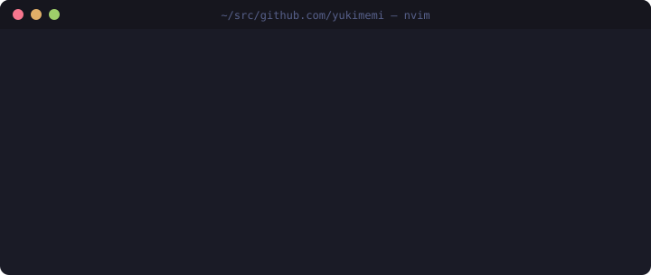

<picture>
  <source media="(prefers-color-scheme: dark)" srcset="./assets/terminal-dark.svg">
  <source media="(prefers-color-scheme: light)" srcset="./assets/terminal-light.svg">
  
</picture>

Neovim user. I build small, sharp dev tools — mostly in **Rust**, plus **TypeScript** (Deno / denops) and **Lua**.
Lately: jj-first workflows and tooling for running AI coding agents side by side.

### 🛠 Tools

| | Project | What it does |
| --- | --- | --- |
|  | [magi](https://github.com/yukimemi/magi) | Blind multi-agent implementation competition + review gate |
|  | [renri](https://github.com/yukimemi/renri) | Unified manager for git worktrees and jj workspaces |
| <picture><source media="(prefers-color-scheme: dark)" srcset="https://raw.githubusercontent.com/yukimemi/kata/main/assets/icon-dark.svg"></picture> | [kata](https://github.com/yukimemi/kata) | Multi-project template applier with AI-delegated merge |
| <picture><source media="(prefers-color-scheme: dark)" srcset="https://raw.githubusercontent.com/yukimemi/shoka/main/assets/icon-dark.svg"></picture> | [shoka](https://github.com/yukimemi/shoka) | jj-aware, TUI-first repository workspace manager |
| <picture><source media="(prefers-color-scheme: dark)" srcset="https://raw.githubusercontent.com/yukimemi/shikigami/main/assets/icon-dark.svg"></picture> | [shikigami](https://github.com/yukimemi/shikigami) | Terminal UI for Jujutsu |
|  | [yui](https://github.com/yukimemi/yui) | Target-as-truth dotfiles manager |
|  | [shun](https://github.com/yukimemi/shun) | Minimal keyboard-driven launcher |
|  | [kagi](https://github.com/yukimemi/kagi) | Cross-platform key mapper with IME control |
| <picture><source media="(prefers-color-scheme: dark)" srcset="https://raw.githubusercontent.com/yukimemi/yaiba/main/assets/icon-dark.svg"></picture> | [yaiba](https://github.com/yukimemi/yaiba) | Vim-flavoured todo & gantt planner with peer-to-peer sync |

### 🌙 Neovim

| Project | What it does |
| --- | --- |
| [rvpm](https://github.com/yukimemi/rvpm) | Fast plugin manager with a pre-compiled loader |
| [dvpm](https://github.com/yukimemi/dvpm) | Denops plugin manager |
| [shikigami.nvim](https://github.com/yukimemi/shikigami.nvim) | Neovim front end for the shikigami jj TUI |
| [silentsaver.nvim](https://github.com/yukimemi/silentsaver.nvim) | Silent, versioned file backups |
| [lumiris.nvim](https://github.com/yukimemi/lumiris.nvim) | Colorscheme rotation that learns what you like |

### 📝 Latest on [Zenn](https://zenn.dev/yukimemi)

<!-- zenn:start -->
| Article | Date |
| --- | --- |
| [Vim風操作と即時P2P同期を備えたローカルガントチャート yaiba](https://zenn.dev/yukimemi/articles/2026-08-08-yaiba) | 2026-08-08 |
| [ライブ設定を直接編集、リポジトリが自動追従する dotfiles マネージャー yui](https://zenn.dev/yukimemi/articles/2026-06-13-yui) | 2026-06-13 |
| [複数プロジェクトのテンプレを束ねる kata](https://zenn.dev/yukimemi/articles/2026-05-24-kata) | 2026-05-24 |
| [ルールベースでファイルや URL を届ける Rust 製ディスパッチャ todoke を作った](https://zenn.dev/yukimemi/articles/2026-04-25-todoke) | 2026-04-25 |
| [Rust 製の事前コンパイル型 Neovim プラグインマネージャー rvpm を作った](https://zenn.dev/yukimemi/articles/2026-04-19-rvpm) | 2026-04-19 |
<!-- zenn:end -->

### 📦 Recent releases

<!-- releases:start -->
| Repo | Release | Date |
| --- | --- | --- |
| [magi](https://github.com/yukimemi/magi) | [`v0.97.0`](https://github.com/yukimemi/magi/releases/tag/v0.97.0) | 2026-10-07 |
| [yui](https://github.com/yukimemi/yui) | [`v0.15.4`](https://github.com/yukimemi/yui/releases/tag/v0.15.4) | 2026-10-07 |
| [shoka](https://github.com/yukimemi/shoka) | [`v0.25.0`](https://github.com/yukimemi/shoka/releases/tag/v0.25.0) | 2026-10-05 |
| [shikigami](https://github.com/yukimemi/shikigami) | [`v0.13.0`](https://github.com/yukimemi/shikigami/releases/tag/v0.13.0) | 2026-10-05 |
| [omp-deck](https://github.com/yukimemi/omp-deck) | [`v0.13.0`](https://github.com/yukimemi/omp-deck/releases/tag/v0.13.0) | 2026-10-04 |
| [todoke](https://github.com/yukimemi/todoke) | [`v2.4.1`](https://github.com/yukimemi/todoke/releases/tag/v2.4.1) | 2026-10-04 |
| [shun](https://github.com/yukimemi/shun) | [`v5.5.5`](https://github.com/yukimemi/shun/releases/tag/v5.5.5) | 2026-09-27 |
| [rvpm](https://github.com/yukimemi/rvpm) | [`v3.52.0`](https://github.com/yukimemi/rvpm/releases/tag/v3.52.0) | 2026-09-26 |
<!-- releases:end -->

### 🐍 Activity

<picture>
  <source media="(prefers-color-scheme: dark)" srcset="https://raw.githubusercontent.com/yukimemi/yukimemi/output/github-contribution-grid-snake-dark.svg">
  <source media="(prefers-color-scheme: light)" srcset="https://raw.githubusercontent.com/yukimemi/yukimemi/output/github-contribution-grid-snake.svg">
  
</picture>

Header and release list regenerate daily via <a href="./scripts/profile.ts"><code>scripts/profile.ts</code></a>.
